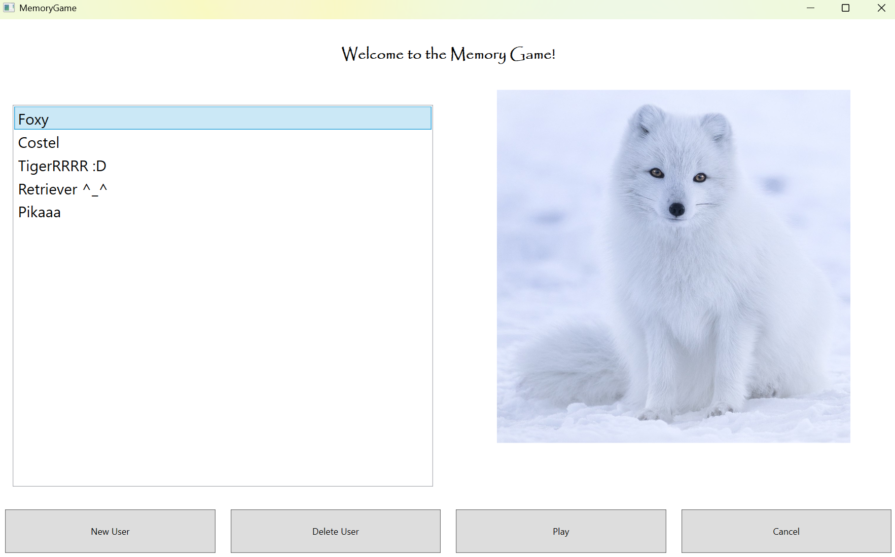
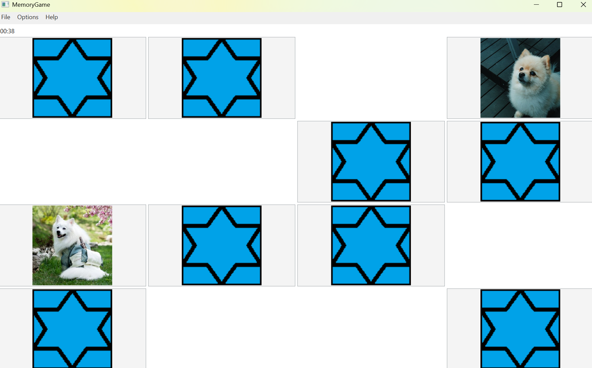
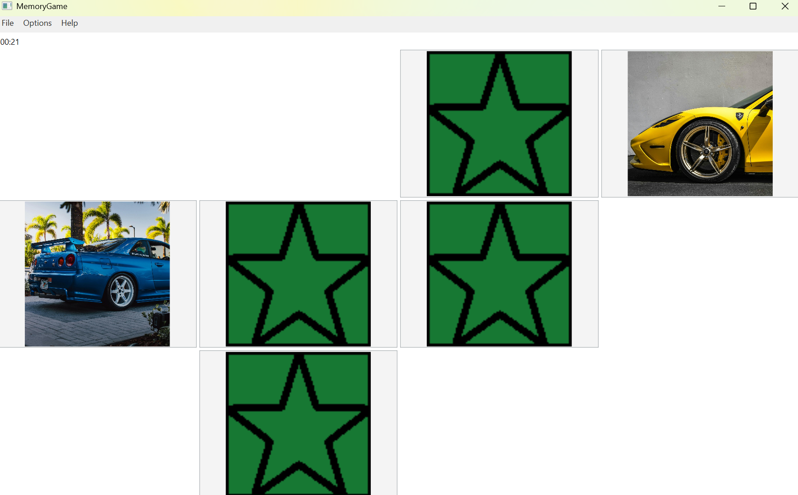

# Memory Game 🧠

Welcome to **Memory Game** — a fun and interactive memory card matching game built in **C#** using **WPF** and following the **MVVM** architectural pattern.

Whether you're into flowers, cars, dogs, or your own personal photo collection, this game lets you match image pairs, compete with yourself and others, and pick up exactly where you left off. Designed for flexibility and fun!

---

## 🎮 Features

- **👤 User Accounts**  
  Create your own account to save progress and track your stats.

- **📂 Categories**  
  Choose from predefined categories or create your own with your favorite images!

- **🕹 Game Modes**  
  - **Standard Mode**: 4x4 grid, 60-second challenge.  
  - **Custom Mode**: Set your own grid size and time limit to suit your style.

- **💾 Save & Resume**  
  Save your game at any point and resume later without losing progress.

- **📊 Stats & Leaderboards**  
  Compare your performance with other users and track your improvement over time.

- **🖼 Custom Content**  
  Add your own images to categories. For the best visual experience, crop your images to a **1:1 ratio** (square).

---

## 🚀 Getting Started

1. **Clone the Repository**

2. **Add your images in their corresponding place in `Resources` directory**

3. **Build & Run**

---

## 🧠 How to Play

1. Log in or create an account.
2. Choose a category.
3. Select a game mode (standard or custom).
4. Match all the pairs as fast as you can!
5. Save your game to continue later if needed.
6. View your stats and compete against other players.

---

## 📸 Screenshots

> ⚠️ **Disclaimer:**  
> The images used in the demo screenshots are for demonstration purposes only. I do not own any rights to them.

---

## 🛠 Tech Stack

- **C#**
- **WPF (.NET)**
- **MVVM Architecture**

---

Have fun playing and matching! 🧩🎉

---
